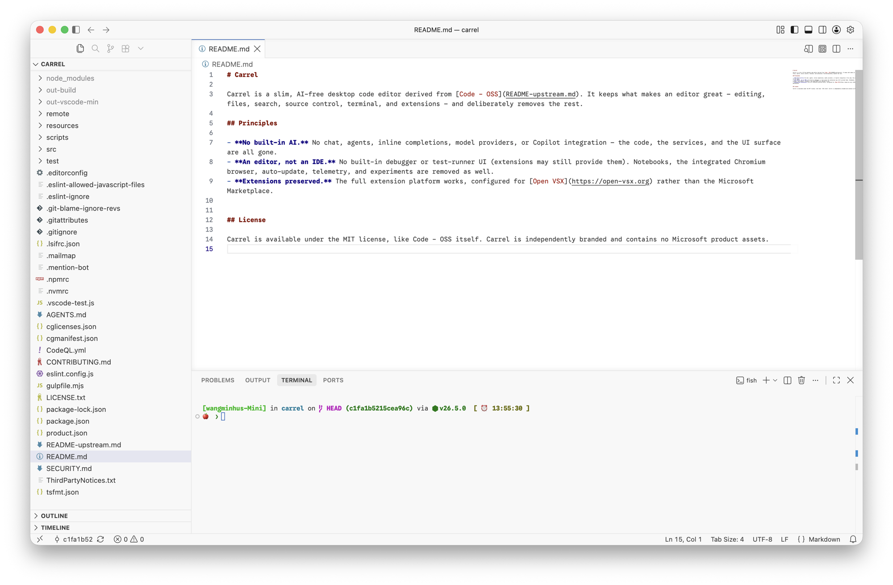

# Carrel

Carrel is a slim, AI-free desktop code editor derived from [Code - OSS](README-upstream.md). It keeps what makes an editor great — editing, files, search, source control, terminal, and extensions — and deliberately removes the rest.

<p align="center">
  
</p>

## Installation

With [Homebrew](https://brew.sh) (macOS, Apple silicon):

```sh
brew install --cask minhuw/carrel/carrel
```

Or download `Carrel-darwin-arm64-<version>.zip` directly from [GitHub Releases](https://github.com/minhuw/carrel/releases).

**A note on trust:** Carrel is signed with a personal Apple Development certificate, not a notarized Developer ID. macOS Gatekeeper only blocks apps carrying the quarantine attribute — the cask clears it automatically on install; for a manual zip install, run `xattr -dr com.apple.quarantine /Applications/Carrel.app` once.

## Principles

- **No built-in AI.** No chat, agents, inline completions, model providers, or Copilot integration — the code, the services, and the UI surface are all gone.
- **An editor, not an IDE.** No built-in debugger or test-runner UI (extensions may still provide them). Notebooks, the integrated Chromium browser, auto-update, telemetry, and experiments are removed as well.
- **Extensions preserved.** The full extension platform works, configured for [Open VSX](https://open-vsx.org) rather than the Microsoft Marketplace.


## License

Carrel is available under the MIT license, like Code - OSS itself. Carrel is independently branded and contains no Microsoft product assets.
